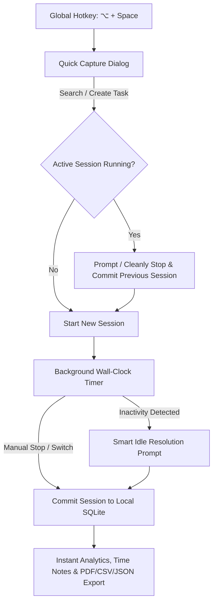

# ⏱️ WorkPulse

<p align="center">
  <strong>Understand your work. Improve your flow.</strong><br>
  <em>A privacy-first, offline-first desktop work-awareness and time-tracking application designed for engineers, creators, and focused professionals.</em>
</p>

<p align="center">
  
  
  
  
  
  
</p>

---

## 💡 Why WorkPulse?

Most time trackers fall into two frustrating extremes:
1. **Creepy surveillance tools** that capture random screenshots, log keystrokes, and monitor background apps.
2. **Clunky corporate portals** with bloated forms, rigid Jira-locked fields, and slow web interfaces that interrupt your flow every time you switch tasks.

**WorkPulse changes that.**

WorkPulse is built from the ground up as a **personal productivity companion**, not a surveillance dashboard. It gives you deep, honest visibility into how your time is allocated—across projects, meetings, deep engineering, code reviews, and unplanned interruptions—with **zero tracking friction** and **absolute privacy**.

```text
    ┌─────────────────────────────────────────────────────────────┐
    │  ⌥ + Space  ──►  Instant Quick Capture (<300ms)             │
    │  Type / Search Task  ──►  Press Enter                       │
    │  Switches cleanly, tracks wall-clock time, stays out of way │
    └─────────────────────────────────────────────────────────────┘
```

---

## ✨ Features & User Value

### ⚡ Instant Quick Capture (`⌥ + Space`)
- **Sub-300ms Response Time**: A lightweight floating palette appears instantly anywhere on macOS via global hotkey (`⌥ + Space` or user-customized shortcut).
- **Keyboard-First Workflow**: Fuzzy search existing tasks, select categories and tags, or type a new work item and hit `Enter`—without your hands leaving the keyboard.
- **Zero Interruption to Flow**: Context switching overhead drops to seconds, keeping your cognitive energy focused on real work.

---

### 🔒 100% Offline & Absolute Privacy
- **Zero Telemetry, Zero Surveillance**: No screen captures, no keystroke recording, no browser snooping, and zero network calls.
- **Local SQLite Engine**: All data lives solely on your machine in a robust local SQLite database (`sqflite_common_ffi`).
- **Enterprise & Client Safe**: Track work freely on confidential codebases, proprietary client accounts, and secure environments without privacy risks.

---

### ⏱️ Timestamp-Based Session Integrity
- **Wall-Clock Accuracy**: Session durations are computed mathematically from immutable start/end timestamps (`duration = endTime - startTime`), never fragile in-memory ticker loops.
- **Resilient to Sleep & Restarts**: Close your laptop lid, reboot your Mac, or recover from unexpected crashes—your active session seamlessly resumes with 100% accurate time.
- **Strict Single-Active Session Invariant**: Exactly one session is active at any time. Starting a new task cleanly closes and commits the previous session automatically with interactive switch confirmation.

---

### 🏷️ Dynamic Configurable Attribute Engine
- **No Hardcoded SaaS Schemas**: Jira, Azure DevOps, ServiceNow, or client billing codes are never hardcoded into the core database.
- **6 Typed Attribute Categories**: Create custom attributes typed as `Text`, `Number`, `Boolean`, `Single Select`, `Multi-Select`, or `Date`.
- **Task & Session Scopes**: Attach attributes at the WorkItem level (e.g. *Ticket Key*, *Client Code*, *Priority*) or individual Session level (e.g. *Focus Rating*, *Location*).
- **Non-Destructive Archiving**: Deleting an attribute soft-archives it (`archived_at`), ensuring your historical logs and reporting never break.

---

### 💤 Smart Inactivity & Idle Management
- **Automatic Away-State Detection**: While a session is running, WorkPulse asks the operating system how long it has been since *any* keyboard or mouse input — Core Graphics on macOS, `GetLastInputInfo` on Windows. It reads a counter the OS already maintains; it never observes what you type. Idle detection is unavailable on Linux, where WorkPulse stays quiet rather than guessing.
- **Configurable Threshold**: Choose how long counts as "away" (3–30 minutes, default 10) from the sidebar footer.
- **Heartbeat Gap Recovery**: If WorkPulse was closed or the machine went to sleep with a timer running, the next launch reconstructs the unaccounted gap via `ActivityHeartbeatService` and prompts before logging it.
- **User-Controlled Resolution**: When you return, choose how to handle the idle gap:
  - ✅ **Keep as Work**: Attribute the duration to offline discussions, sketching, or reading.
  - ⏸️ **Mark as Idle**: Keep the record tagged as inactive.
  - ✂️ **Discard & Stop**: Trim the idle block and record your actual active stopping point.

---

### 🎯 Per-Session Classification
- **The Work Item Seeds, It Does Not Stamp**: A work item's category, tags and people are applied to its **first** session only. Every session after that starts unclassified, because the second hour on a task is rarely the same kind of work as the first — the same ticket can be reading, then a call about it, then the change itself.
- **Classify Where You Are**: Set the running session's category straight from the timer bar's dropdown, or edit any past session from the Time Log.
- **What You See Is What You Logged**: Dashboards and exports show exactly what each session says. Time you haven't classified appears as **Uncategorized** rather than being quietly filed under the work item's category — so the gap is visible and fixable instead of invisible and wrong.
- **Interruptions Don't Reclassify You**: When an idle gap splits a session in two, the resumed half carries the interrupted half's classification forward. One coffee break never splits an afternoon into a classified half and an unclassified one.

---

### 📝 Time Notes & Daily Standup Journaling
- **Session & Task Notes**: Log detailed markdown notes directly against sessions or parent work items.
- **1-Click Standup Summaries**: Instantly compile and copy daily/weekly accomplishments into clean, bulleted Markdown ready to paste into Slack, Teams, or daily standup meetings.
- **Searchable Note Stream**: Filter notes by keyword, project, category, tag, or collaborator.

---

### 📊 Rich Dashboards & Deep Work Analytics
- **Visual Time Breakdowns**: Group time by **Project**, **Category**, **Tag**, **Person**, or any **Custom Attribute**.
- **Interactive Daily Activity Charts**: Inspect hours logged across each day with visual time distributions.
- **Deep Work & Context-Switching Metrics**: Track deep work ratios and context-switch frequency to protect focus time.

---

### 🧭 Patterns & Signals — Where Your Time Actually Goes
Breakdowns tell you *where* the hours went. The **Patterns & Signals** panel at
the foot of the Dashboard tells you *what keeps happening*, and sorts every
finding into the one thing you can do about it. It scans its own rolling window
— **14, 30 or 90 days** — because a pattern needs history to be a pattern.

| Lane | What it surfaces |
| :--- | :--- |
| ✅ **Continue** | What is already working and is worth defending — deep-work share that is healthy or climbing, switching that has fallen since last period, a focus window you are keeping clear, work you picked back up before it became a surprise, and simply turning up on most working days. |
| ♻️ **Reclaim** | Time leaving the day without you choosing to send it — a task picked up nine times before lunch, a switching rate that has become the tax rather than the work, hours captured and then written off as idle. |
| 🤝 **Delegate** | Work that hands over cleanly: tasks that recur on most days and *never once* needed an unbroken block, whole categories that are always shallow, and short standing sessions with the same person that read as a check-in rather than a decision. |
| 🗓️ **Plan** | What next week needs room for — commitments that went quiet after real investment, work that only fitted after 7pm or at weekends, one project starving the others, and the two-hour band where your deep blocks actually land. |

- **It compares like for like**: findings that say "up from" are measured against the window immediately before this one, of equal length. With no history behind it the scan still runs — it just stops speaking about direction rather than guessing at it.
- **Every claim shows its working**: each card carries the figures it was derived from (visits, median session, longest stretch, days recurred) behind a **Show numbers** toggle. Nothing asks to be trusted.
- **A rhythm strip for context**: deep-work share, longest unbroken stretch, sessions per tracked day, and your genuine focus window — an hour of fragmentation means something different if you never get an unbroken hour.
- **Copy as Markdown**: one click puts the findings on the clipboard, ready to paste into a 1:1 agenda or a handover note. Delegating something means telling somebody about it.
- **Rule-based and 100% local**: no model, no network, no telemetry. Every sentence is derived from a figure you could add up by hand from your own Time Log.

---

### 🧾 Time Sheet — CAPEX vs OPEX, Ready to Submit

Every **Category** carries a **Type** — **CAPEX** (capitalizable) or **OPEX**
(operational) — set with a radio button when you create or edit it. Because a
session records its own category, that one field is enough to answer the
question a timesheet actually asks: *how much of this period was building
something, and how much was running it?*

- **A split you can submit**: totals in **decimal hours** (`7.25`, not `7h 15m`), because that is what a timesheet form accepts. The clock reading sits beside it for the hours you recognise as your day.
- **Per project, per attribute**: one CAPEX/OPEX table for projects, then one for every **reportable custom attribute** — cost centre, workstream, epic, whatever your organisation tracks. The tables are two views of the same hours, so they always sum to the same total.
- **Net or Gross, one toggle**: **Net** excludes time you marked idle — what you actually worked. **Gross** is wall-clock desk time, which is usually what reconciles against a contractual week. Both are computed up front, so switching is instant.
- **Nothing is guessed**: a session you left uncategorised is reported in its own **Unclassified** column rather than quietly booked as operational, and the CAPEX ratio is taken over classified time so unfiled hours cannot dilute it.
- **Same window as the Time Log**: pick Today, This Week, This Month or a date once, and both screens follow.

Categories created before this existed are backfilled to **OPEX** — the
conservative reading — and are yours to reclassify on the Categories screen.

---

### 📤 Multi-Format Export & Data Portability
- **Executive Visual PDF Reports**: Generate colorful, high-fidelity PDF work summaries with KPI metric cards, project distributions, and session tables—instantly previewed in macOS Preview.app.
- **RFC 4180 CSV Spreadsheets**: Export tabular session data with custom attribute columns, gross/net durations, and timestamps ready for Excel, Google Sheets, or Numbers.
- **Structured JSON Backups**: Full hierarchical data exports with complete relational integrity and metadata.

---

### ⌨️ Command Palette & Desktop Fluidity
- **Command Palette (`⌘ + K`)**: Jump to any section, execute actions, start work items, or switch themes in keystrokes.
- **macOS Menu Bar Companion**: System tray integration with live running timer status, quick capture trigger, and session controls.
- **Customizable Shortcuts**: Re-bind the global Quick Capture shortcut using the built-in graphical hotkey recorder.

---

## 🔄 How It Works



---

## 🎯 Who is WorkPulse For?

| Role | How WorkPulse Adds Value |
| :--- | :--- |
| 💻 **Software Engineers & Architects** | Effortlessly track time across code reviews, architecture spikes, meetings, and feature development without leaving the keyboard or wrestling with web timesheets. |
| 🎨 **Designers & Creators** | Gain clarity on deep creative focus versus client revisions and sync meetings with zero distraction. |
| 💼 **Consultants & Freelancers** | Categorize work by client, project, and custom billing codes; export spotless CSV reports and executive PDFs for client billing in seconds. |
| 🚀 **Product & Engineering Leaders** | Understand personal bandwidth, spot meeting fatigue, and generate formatted standup recaps with zero invasive corporate surveillance. |

---

## 🏛️ Architecture & Principles

WorkPulse is built following clean, domain-driven architecture and strict modular boundaries:

```text
lib/
├── core/         # Theme, design tokens, database setup, utilities, platform bridges
├── domain/       # Pure Dart business models, state machines, repository contracts (Zero Flutter/SQLite dependencies)
├── data/         # SQLite tables, versioned migrations (v1-v5), repository implementations
└── features/     # Feature vertical slices (UI, Riverpod state notifiers, dialogs, widgets)
    ├── quick_capture/ # Floating & standalone Quick Capture HUD
    ├── timer/         # Active timer bar, switch dialog, ticker providers
    ├── dashboard/     # Metric cards, activity charts, breakdowns, pattern insights
    ├── notes/         # Time notes view, standup generator, search
    ├── tasks/         # Work items, inspector panel, filter toolbar
    ├── projects/      # Project management & color coding
    ├── categories/    # Category classification & icon library
    ├── tags/          # Cross-cutting labels & color badges
    ├── people/        # Collaborators & team tracking
    ├── attributes/    # Configurable attribute definitions & options
    ├── reports/       # Time log, session editor, PDF/CSV/JSON export
    ├── idle/          # Inactivity prompt & gap resolution
    ├── shell/         # Main layout, sidebar, command palette, shortcuts
    ├── settings/      # Preferences, theme mode, hotkey configuration
    └── tray/          # macOS menu bar status item & menu
```

### The 10 Invariant Architectural Rules
1. **Zero External Tool Hardcoding**: External tool fields (Jira, ServiceNow, etc.) are purely user-configurable attributes.
2. **Configurable Metadata**: Powered by `AttributeDefinition`, `AttributeOption`, and typed value models.
3. **Sub-300ms Quick Capture**: Floating, ultra-fast keyboard-first palette.
4. **Single Active Session**: Exactly one work session active at any given moment.
5. **Timestamp-Based Session Truth**: Elapsed durations calculated exclusively via `endTime - startTime`.
6. **No Silent Data Loss**: Deletions use soft-archiving (`archived_at`) to preserve historical accuracy.
7. **Session Independence**: Stopping a timer closes the session, but leaves the work item open to resume later. A work item's category, tags and people seed only its *first* session; every session after that is classified per session, and nothing is borrowed from the work item at read time.
8. **Offline-First & Zero Telemetry**: 100% local persistence via SQLite (`sqflite_common_ffi`).
9. **Isolated Platform Bridges**: Native macOS integrations (Hotkeys, Tray, Window management) live behind abstract interfaces.
10. **Strict Database Versioning**: All schema modifications are version-controlled with `PRAGMA user_version` migrations.

---

## ⌨️ Keyboard Shortcuts

WorkPulse binds both the macOS and the Windows accelerator for every in-app
shortcut, and the hints shown in the UI are spelled for the platform you are
on — <kbd>⌘K</kbd> on macOS, <kbd>Ctrl+K</kbd> on Windows. The table below
writes the macOS form; substitute <kbd>Ctrl</kbd> for <kbd>⌘ Cmd</kbd> and
<kbd>Alt</kbd> for <kbd>⌥ Option</kbd> on Windows.

| Shortcut | Scope | Action |
| :--- | :--- | :--- |
| <kbd>⌥ Option</kbd> + <kbd>Space</kbd> | Global | Toggle Quick Capture floating dialog from anywhere (re-bindable) |
| <kbd>⌘ Cmd</kbd> + <kbd>K</kbd> | In-App | Open Command Palette (navigate, actions, switch themes) |
| <kbd>⌘ Cmd</kbd> + <kbd>N</kbd> | In-App | Create new item in context (Task, Project, etc.) |
| <kbd>⌘ Cmd</kbd> + <kbd>F</kbd> | In-App | Focus the current screen's search field |
| <kbd>⌘ Cmd</kbd> + <kbd>.</kbd> | In-App | Stop currently running timer |
| <kbd>⌘ Cmd</kbd> + <kbd>E</kbd> | In-App | Open Export Data dialog (PDF / CSV / JSON) |
| <kbd>⌘ Cmd</kbd> + <kbd>↩ Enter</kbd> | Dialogs | Submit the open form from anywhere inside it |
| <kbd>⌘ Cmd</kbd> + <kbd>1</kbd>…<kbd>9</kbd> | In-App | Jump to Dashboard, Patterns & Signals, Work Items, Time Log, Time Notes, Time Sheet, Projects, Categories, Tags |
| <kbd>Enter</kbd> | In-App / HUD | Confirm and start/switch tracking session; confirm a destructive dialog |
| <kbd>Esc</kbd> | In-App / HUD | Dismiss Quick Capture, close the active modal, or clear a search field |
| <kbd>Tab</kbd> / <kbd>Shift + Tab</kbd> | In-App / HUD | Cycle through form inputs, list rows and suggestions |
| <kbd>↑</kbd> / <kbd>↓</kbd> | In-App / HUD | Navigate search suggestions, command palette and dropdown options |
| <kbd>Home</kbd> / <kbd>End</kbd> | Command Palette | Jump to the first / last result |
| <kbd>Space</kbd> | In-App | Open the focused dropdown; activate the focused control |

Keyboard focus is drawn with the palette's focus ring on every list row, card,
navigation item and input, so the current position is always visible.

---

## 🚀 Getting Started

### Prerequisites
- **Flutter SDK**: `>= 3.38.4` (Dart `>= 3.12.0`) — see `pubspec.lock`
- **macOS**: 12.0+ (Monterey or newer), Apple Silicon (M1/M2/M3/M4) or Intel (x86_64), with Xcode Command Line Tools (`xcode-select --install`)
- **Windows**: Windows 10 (1809) or newer, x64, with Visual Studio 2022 and the "Desktop development with C++" workload

### Installation & Setup

1. **Clone the repository:**
   ```bash
   git clone https://github.com/kishorekumarhemraj/WorkPulse.git
   cd WorkPulse
   ```

2. **Install Flutter dependencies:**
   ```bash
   flutter pub get
   ```

3. **Launch WorkPulse:**
   ```bash
   flutter run -d macos     # macOS
   flutter run -d windows   # Windows
   ```

---

## 🧪 Testing

WorkPulse includes a comprehensive automated test suite spanning unit tests, database migrations, repository contracts, and widget tests.

```bash
# Run the complete test suite
flutter test

# Run database schema & migration tests (v1 -> v5)
flutter test test/data/database_migration_test.dart

# Run SQLite repository CRUD tests
flutter test test/data/sqlite_repositories_test.dart

# Run domain service tests (Timer, Task Switcher, Idle, Heartbeat, PDF Report)
flutter test test/unit/services/

# Run Riverpod state notifier tests
flutter test test/unit/providers/

# Run widget, responsive layout, and UI tests
flutter test test/widget/

# Run integration & end-to-end task switching tests
flutter test test/integration/
```

---

## 📦 Building for Release

```bash
flutter build macos --release     # -> build/macos/Build/Products/Release/WorkPulse.app
flutter build windows --release   # -> build/windows/x64/runner/Release/
```

On Windows the whole `Release` directory is the distributable: the `.exe`
alone will not start without the bundled Flutter DLLs and the `data/` folder.

Both platforms are built and tested on every pull request by
`.github/workflows/ci.yml`, and released together by
`.github/workflows/release.yml`.

---

## 📚 Project Documentation

- 📖 [Product & Technical Specification](docs/WORKPULSE_SPEC.md) (`docs/WORKPULSE_SPEC.md`)
- 🏗️ [Architecture & Technical Design](docs/DESIGN.md) (`docs/DESIGN.md`)
- 🧾 [ADR 001 — System Idle Detection](docs/adr/001-system-idle-detection.md) (`docs/adr/001-system-idle-detection.md`)
- 🛠️ [Developer Guide](docs/DEVELOPMENT.md) (`docs/DEVELOPMENT.md`)
- 🤖 [Agent Guidelines](AGENTS.md) (`AGENTS.md`)
- 📋 [Sprint Roadmap Guide](.agents/skills/workpulse-sprint-guide/SKILL.md) (`.agents/skills/workpulse-sprint-guide/SKILL.md`)
- 🧭 [Domain Model & State Machines](.agents/skills/workpulse-domain/SKILL.md) (`.agents/skills/workpulse-domain/SKILL.md`)

---

## 📄 License

This project is licensed under the MIT License - see the [LICENSE](LICENSE) file for details.

