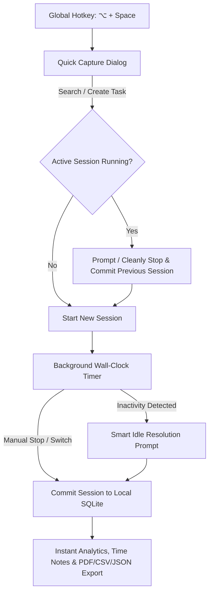

# ⏱️ WorkPulse

<p align="center">
  <strong>Understand your work. Improve your flow.</strong><br>
  <em>A privacy-first, offline-first macOS work-awareness and time-tracking application designed for engineers, creators, and focused professionals.</em>
</p>

<p align="center">
  
  
  
  
  
</p>

---

## 💡 Why WorkPulse?

Most time trackers fall into two frustrating extremes:
1. **Creepy surveillance tools** that capture random screenshots, log keystrokes, and monitor background apps.
2. **Clunky corporate portals** with bloated forms, rigid Jira-locked fields, and slow web interfaces that interrupt your flow every time you switch tasks.

**WorkPulse changes that.**

WorkPulse is built from the ground up as a **personal productivity companion**, not a surveillance dashboard. It gives you deep, honest visibility into how your time is allocated—across projects, meetings, deep engineering, code reviews, and unplanned interruptions—with **zero tracking friction** and **absolute privacy**.

```text
    ┌─────────────────────────────────────────────────────────────┐
    │  ⌥ + Space  ──►  Instant Quick Capture (<300ms)             │
    │  Type / Search Task  ──►  Press Enter                       │
    │  Switches cleanly, tracks wall-clock time, stays out of way │
    └─────────────────────────────────────────────────────────────┘
```

---

## ✨ Features & User Value

### ⚡ Instant Quick Capture (`⌥ + Space`)
- **Sub-300ms Response Time**: A lightweight floating palette appears instantly anywhere on macOS via global hotkey (`⌥ + Space` or user-customized shortcut).
- **Keyboard-First Workflow**: Fuzzy search existing tasks, select categories and tags, or type a new work item and hit `Enter`—without your hands leaving the keyboard.
- **Zero Interruption to Flow**: Context switching overhead drops to seconds, keeping your cognitive energy focused on real work.

---

### 🔒 100% Offline & Absolute Privacy
- **Zero Telemetry, Zero Surveillance**: No screen captures, no keystroke recording, no browser snooping, and zero network calls.
- **Local SQLite Engine**: All data lives solely on your machine in a robust local SQLite database (`sqflite_common_ffi`).
- **Enterprise & Client Safe**: Track work freely on confidential codebases, proprietary client accounts, and secure environments without privacy risks.

---

### ⏱️ Timestamp-Based Session Integrity
- **Wall-Clock Accuracy**: Session durations are computed mathematically from immutable start/end timestamps (`duration = endTime - startTime`), never fragile in-memory ticker loops.
- **Resilient to Sleep & Restarts**: Close your laptop lid, reboot your Mac, or recover from unexpected crashes—your active session seamlessly resumes with 100% accurate time.
- **Strict Single-Active Session Invariant**: Exactly one session is active at any time. Starting a new task cleanly closes and commits the previous session automatically with interactive switch confirmation.

---

### 🏷️ Dynamic Configurable Attribute Engine
- **No Hardcoded SaaS Schemas**: Jira, Azure DevOps, ServiceNow, or client billing codes are never hardcoded into the core database.
- **6 Typed Attribute Categories**: Create custom attributes typed as `Text`, `Number`, `Boolean`, `Single Select`, `Multi-Select`, or `Date`.
- **Task & Session Scopes**: Attach attributes at the WorkItem level (e.g. *Ticket Key*, *Client Code*, *Priority*) or individual Session level (e.g. *Focus Rating*, *Location*).
- **Non-Destructive Archiving**: Deleting an attribute soft-archives it (`archived_at`), ensuring your historical logs and reporting never break.

---

### 💤 Smart Inactivity & Idle Management
- **Automatic Away-State Detection**: Detects when you step away from your Mac during an active tracking session.
- **Heartbeat Gap Recovery**: If WorkPulse was closed or the Mac went to sleep with a timer running, the next launch reconstructs the unaccounted gap via `ActivityHeartbeatService` and prompts the user before logging.
- **User-Controlled Resolution**: When you return, choose how to handle the idle gap:
  - ✅ **Keep as Work**: Attribute the duration to offline discussions, sketching, or reading.
  - ⏸️ **Mark as Idle**: Keep the record tagged as inactive.
  - ✂️ **Discard & Stop**: Trim the idle block and record your actual active stopping point.

---

### 📝 Time Notes & Daily Standup Journaling
- **Session & Task Notes**: Log detailed markdown notes directly against sessions or parent work items.
- **1-Click Standup Summaries**: Instantly compile and copy daily/weekly accomplishments into clean, bulleted Markdown ready to paste into Slack, Teams, or daily standup meetings.
- **Searchable Note Stream**: Filter notes by keyword, project, category, tag, or collaborator.

---

### 📊 Rich Dashboards & Deep Work Analytics
- **Visual Time Breakdowns**: Group time by **Project**, **Category**, **Tag**, **Person**, or any **Custom Attribute**.
- **Interactive Daily Activity Charts**: Inspect hours logged across each day with visual time distributions.
- **Deep Work & Context-Switching Metrics**: Track deep work ratios and context-switch frequency to protect focus time.

---

### 📤 Multi-Format Export & Data Portability
- **Executive Visual PDF Reports**: Generate colorful, high-fidelity PDF work summaries with KPI metric cards, project distributions, and session tables—instantly previewed in macOS Preview.app.
- **RFC 4180 CSV Spreadsheets**: Export tabular session data with custom attribute columns, gross/net durations, and timestamps ready for Excel, Google Sheets, or Numbers.
- **Structured JSON Backups**: Full hierarchical data exports with complete relational integrity and metadata.

---

### ⌨️ Command Palette & Desktop Fluidity
- **Command Palette (`⌘ + K`)**: Jump to any section, execute actions, start work items, or switch themes in keystrokes.
- **macOS Menu Bar Companion**: System tray integration with live running timer status, quick capture trigger, and session controls.
- **Customizable Shortcuts**: Re-bind the global Quick Capture shortcut using the built-in graphical hotkey recorder.

---

## 🔄 How It Works



---

## 🎯 Who is WorkPulse For?

| Role | How WorkPulse Adds Value |
| :--- | :--- |
| 💻 **Software Engineers & Architects** | Effortlessly track time across code reviews, architecture spikes, meetings, and feature development without leaving the keyboard or wrestling with web timesheets. |
| 🎨 **Designers & Creators** | Gain clarity on deep creative focus versus client revisions and sync meetings with zero distraction. |
| 💼 **Consultants & Freelancers** | Categorize work by client, project, and custom billing codes; export spotless CSV reports and executive PDFs for client billing in seconds. |
| 🚀 **Product & Engineering Leaders** | Understand personal bandwidth, spot meeting fatigue, and generate formatted standup recaps with zero invasive corporate surveillance. |

---

## 🏛️ Architecture & Principles

WorkPulse is built following clean, domain-driven architecture and strict modular boundaries:

```text
lib/
├── core/         # Theme, design tokens, database setup, utilities, platform bridges
├── domain/       # Pure Dart business models, state machines, repository contracts (Zero Flutter/SQLite dependencies)
├── data/         # SQLite tables, versioned migrations (v1-v4), repository implementations
└── features/     # Feature vertical slices (UI, Riverpod state notifiers, dialogs, widgets)
    ├── quick_capture/ # Floating & standalone Quick Capture HUD
    ├── timer/         # Active timer bar, switch dialog, ticker providers
    ├── dashboard/     # Metric cards, activity charts, breakdown widgets
    ├── notes/         # Time notes view, standup generator, search
    ├── tasks/         # Work items, inspector panel, filter toolbar
    ├── projects/      # Project management & color coding
    ├── categories/    # Category classification & icon library
    ├── tags/          # Cross-cutting labels & color badges
    ├── people/        # Collaborators & team tracking
    ├── attributes/    # Configurable attribute definitions & options
    ├── reports/       # Time log, session editor, PDF/CSV/JSON export
    ├── idle/          # Inactivity prompt & gap resolution
    ├── shell/         # Main layout, sidebar, command palette, shortcuts
    ├── settings/      # Preferences, theme mode, hotkey configuration
    └── tray/          # macOS menu bar status item & menu
```

### The 10 Invariant Architectural Rules
1. **Zero External Tool Hardcoding**: External tool fields (Jira, ServiceNow, etc.) are purely user-configurable attributes.
2. **Configurable Metadata**: Powered by `AttributeDefinition`, `AttributeOption`, and typed value models.
3. **Sub-300ms Quick Capture**: Floating, ultra-fast keyboard-first palette.
4. **Single Active Session**: Exactly one work session active at any given moment.
5. **Timestamp-Based Session Truth**: Elapsed durations calculated exclusively via `endTime - startTime`.
6. **No Silent Data Loss**: Deletions use soft-archiving (`archived_at`) to preserve historical accuracy.
7. **Session Independence**: Stopping a timer closes the session, but leaves the work item open to resume later.
8. **Offline-First & Zero Telemetry**: 100% local persistence via SQLite (`sqflite_common_ffi`).
9. **Isolated Platform Bridges**: Native macOS integrations (Hotkeys, Tray, Window management) live behind abstract interfaces.
10. **Strict Database Versioning**: All schema modifications are version-controlled with `PRAGMA user_version` migrations.

---

## ⌨️ Keyboard Shortcuts

| Shortcut | Scope | Action |
| :--- | :--- | :--- |
| <kbd>⌥ Option</kbd> + <kbd>Space</kbd> | Global | Toggle Quick Capture floating dialog from anywhere |
| <kbd>⌘ Cmd</kbd> + <kbd>K</kbd> | In-App | Open Command Palette (navigate, actions, switch themes) |
| <kbd>⌘ Cmd</kbd> + <kbd>N</kbd> | In-App | Create new item in context (Task, Project, etc.) |
| <kbd>⌘ Cmd</kbd> + <kbd>.</kbd> | In-App | Stop currently running timer |
| <kbd>⌘ Cmd</kbd> + <kbd>E</kbd> | In-App | Open Export Data dialog (PDF / CSV / JSON) |
| <kbd>⌘ Cmd</kbd> + <kbd>1</kbd> | In-App | Go to **Dashboard** |
| <kbd>⌘ Cmd</kbd> + <kbd>2</kbd> | In-App | Go to **Time Log** (Session History) |
| <kbd>⌘ Cmd</kbd> + <kbd>3</kbd> | In-App | Go to **Work Items** (Tasks) |
| <kbd>⌘ Cmd</kbd> + <kbd>4</kbd> | In-App | Go to **Time Notes** (Standup Summary) |
| <kbd>⌘ Cmd</kbd> + <kbd>5</kbd> | In-App | Go to **Projects** |
| <kbd>⌘ Cmd</kbd> + <kbd>6</kbd> | In-App | Go to **Categories** |
| <kbd>⌘ Cmd</kbd> + <kbd>7</kbd> | In-App | Go to **Tags** |
| <kbd>⌘ Cmd</kbd> + <kbd>8</kbd> | In-App | Go to **People** |
| <kbd>⌘ Cmd</kbd> + <kbd>9</kbd> | In-App | Go to **Custom Attributes** |
| <kbd>Enter</kbd> | In-App / HUD | Confirm and start/switch tracking session |
| <kbd>Esc</kbd> | In-App / HUD | Dismiss Quick Capture / close active modal dialog |
| <kbd>Tab</kbd> / <kbd>Shift + Tab</kbd> | In-App / HUD | Cycle through form inputs and suggestions |
| <kbd>↑</kbd> / <kbd>↓</kbd> | In-App / HUD | Navigate search suggestions and dropdown options |

---

## 🚀 Getting Started

### Prerequisites
- **macOS**: 12.0+ (Monterey or newer), supporting both Apple Silicon (M1/M2/M3/M4) and Intel (x86_64).
- **Flutter SDK**: `>= 3.16.0`
- **Dart SDK**: `>= 3.2.0`
- **Xcode**: Command Line Tools installed (`xcode-select --install`)

### Installation & Setup

1. **Clone the repository:**
   ```bash
   git clone https://github.com/kishorekumarhemraj/WorkPulse.git
   cd WorkPulse
   ```

2. **Install Flutter dependencies:**
   ```bash
   flutter pub get
   ```

3. **Generate code (Riverpod & Models):**
   ```bash
   dart run build_runner build --delete-conflicting-outputs
   ```

4. **Launch WorkPulse on macOS:**
   ```bash
   flutter run -d macos
   ```

---

## 🧪 Testing

WorkPulse includes a comprehensive automated test suite spanning unit tests, database migrations, repository contracts, and widget tests.

```bash
# Run the complete test suite
flutter test

# Run database schema & migration tests (v1 -> v4)
flutter test test/data/database_migration_test.dart

# Run SQLite repository CRUD tests
flutter test test/data/sqlite_repositories_test.dart

# Run domain service tests (Timer, Task Switcher, Idle, Heartbeat, PDF Report)
flutter test test/unit/services/

# Run Riverpod state notifier tests
flutter test test/unit/providers/

# Run widget, responsive layout, and UI tests
flutter test test/widget/

# Run integration & end-to-end task switching tests
flutter test test/integration/
```

---

## 📦 Building for Release

To package a standalone, optimized macOS application:

```bash
flutter build macos --release
```

The resulting application bundle will be located at:
`build/macos/Build/Products/Release/workpulse.app`

---

## 📚 Project Documentation

- 📖 [Product & Technical Specification](docs/WORKPULSE_SPEC.md) (`docs/WORKPULSE_SPEC.md`)
- 🏗️ [Architecture & Technical Design](docs/DESIGN.md) (`docs/DESIGN.md`)
- 🛠️ [Developer Guide](docs/DEVELOPMENT.md) (`docs/DEVELOPMENT.md`)
- 🤖 [Agent Guidelines](AGENTS.md) (`AGENTS.md`)
- 📋 [Sprint Roadmap Guide](.agents/skills/workpulse-sprint-guide/SKILL.md) (`.agents/skills/workpulse-sprint-guide/SKILL.md`)
- 🧭 [Domain Model & State Machines](.agents/skills/workpulse-domain/SKILL.md) (`.agents/skills/workpulse-domain/SKILL.md`)

---

## 📄 License

This project is licensed under the MIT License - see the [LICENSE](LICENSE) file for details.

